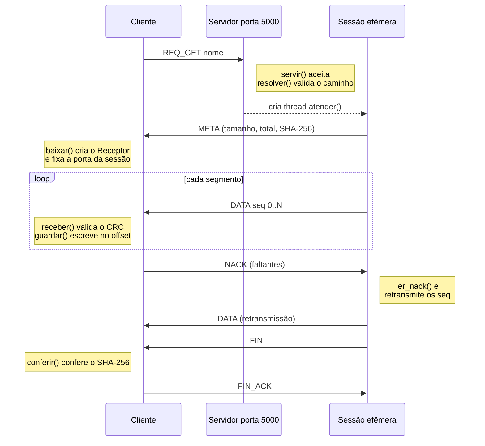
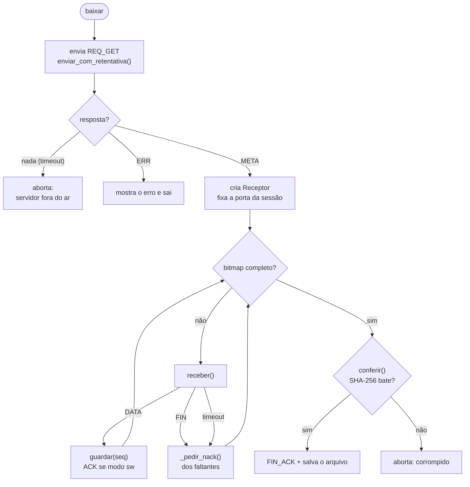
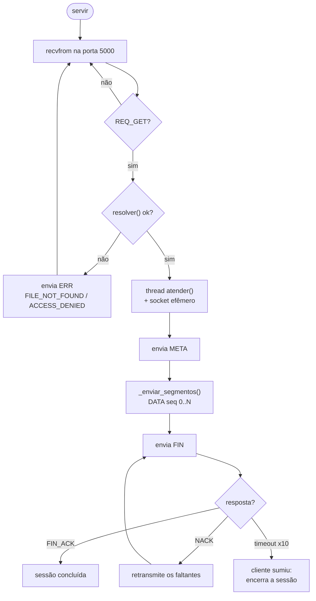

# Trabalho 1 — Transferência de arquivos confiável sobre UDP

ICSR30 — UTFPR/DAINF — Prof. Mauro Fonseca

Cliente/servidor de transferência de arquivos sobre **UDP puro**, em Python, com os
mecanismos de confiabilidade (segmentação, numeração, checksum, detecção de perda e
retransmissão) implementados na camada de aplicação.

Usa apenas a biblioteca padrão, e o módulo `socket` diretamente — nenhuma biblioteca
que abstraia UDP.

## Arquivos

```
protocolo.py       cabeçalho de 20 bytes, tipos de mensagem, CRC32
rede.py            SocketUDP — o único módulo que fala com o SO
servidor.py        escuta, sanitização de path, sessões em thread
cliente.py         requisição, recepção, simulação de perda, NACK
gerar_arquivo.py   cria o binário de teste
tarefas.py         atalhos (demo/duplo/setup/limpar) — "Makefile" em Python
docs/REDES.md      referência da API de sockets em Python
arquivos/          raiz servida pelo servidor  (não versionada)
downloads/         saída do cliente            (não versionada)
```

Três camadas, de baixo para cima: `protocolo.py` só mexe em bytes (não abre socket
nenhum); `rede.py` concentra todas as chamadas ao sistema operacional; `servidor.py`
e `cliente.py` têm a lógica de transferência. Os dois **usam** `SocketUDP` por
composição, não herdam dele — nenhum dos dois *é* um socket, e o servidor usa dois ao
mesmo tempo (o de escuta e um por sessão).

---

# Como funciona — o caminho do arquivo

Esta seção segue uma transferência do início ao fim, dizendo em cada passo qual função
entra em ação e por que cada decisão de projeto foi tomada. É o roteiro para ler o código.

O caminho, resumido em uma linha:

```
arquivo no disco (servidor)
   → lido em pedaços de 1024 B → embrulhado num datagrama DATA (cabeçalho + CRC)
   → UDP → validado no cliente → escrito no offset certo pelo nº de sequência
   → buracos detectados → pedidos de volta (NACK) → SHA-256 confere → salvo no disco
```

## Visão geral — a troca de mensagens

Os passos de cada lado e a ordem em que as mensagens andam entre eles. Repare na troca de
porta: o pedido vai para a porta conhecida (5000), mas os dados vêm da porta efêmera da
sessão.



## O caminho de uma mensagem pelas funções

Um segmento `DATA`, do arquivo no disco do servidor até o disco do cliente, passando por
cada função. É a mesma pilha que a explicação por passos detalha abaixo.

```mermaid
flowchart LR
    subgraph SRV["servidor.py + rede.py + protocolo.py"]
        direction TB
        A["atender()"] --> B["_enviar_segmentos()<br/>seek(seq*1024) + read"]
        B --> C["SocketUDP.enviar()"]
        C --> D["protocolo.empacotar()<br/>cabeçalho + CRC32"]
        D --> E["socket.sendto()"]
    end
    E -->|"datagrama UDP · 1044 B"| F
    subgraph CLI["cliente.py + rede.py + protocolo.py"]
        direction TB
        F["socket.recvfrom()"] --> G["SocketUDP.receber()<br/>confere a origem"]
        G --> H["protocolo.desempacotar()<br/>valida o CRC"]
        H --> I["Receptor.guardar()<br/>seek(seq*1024) + write"]
        I --> J["bitmap: recebidos[seq] = 1"]
    end
```



O pedido de retransmissão faz o caminho inverso: `Receptor.faltantes()` → `_pedir_nack()`
→ `SocketUDP.enviar()` → `protocolo.montar_nack()` → rede → `protocolo.ler_nack()` no
servidor → `_enviar_segmentos()` com os seq pedidos.

## Passo 0 — o formato de cada datagrama (`protocolo.py`)

Antes do fluxo, o alfabeto. Todo datagrama começa por um **cabeçalho de 20 bytes**,
montado por `empacotar()` e conferido por `desempacotar()`:

```
magic(2) versão(1) tipo(1) sessão(4) seq(4) tam(2) crc32(4) flags(2)
```

- `magic` = `0x5544` ("UD"): permite descartar num relance qualquer lixo que caia na
  porta — em UDP isso é normal.
- `seq`: número de sequência do segmento, começando em 0. É ele que dá **ordem** a um
  protocolo que não a garante.
- `crc32`: cobre cabeçalho + payload (com o próprio campo zerado no cálculo). Detecta
  corrupção de um segmento. Calculado com `zlib.crc32`.
- `tam` e `flags`: tamanho do payload e o bit `FLAG_ULTIMO`, que marca o último segmento.

Tudo em *network byte order* (o `!` do `struct`). `desempacotar()` **valida antes de
usar** — magic, versão, coerência de tamanho e CRC — e levanta `PacoteInvalido` para
qualquer datagrama suspeito, que o resto do código simplesmente ignora.

Os oito tipos de mensagem trocados:

| tipo | direção | conteúdo |
|---|---|---|
| `REQ_GET` | C → S | nome do arquivo |
| `META` | S → C | tamanho, total de segmentos, SHA-256 |
| `DATA` | S → C | até 1024 B do arquivo |
| `ACK` | C → S | nº de sequência confirmado (usado no modo Stop-and-Wait) |
| `NACK` | C → S | lista dos nºs de sequência que faltam |
| `ERR` | S → C | código + mensagem |
| `FIN` / `FIN_ACK` | S ↔ C | fim da transmissão / confirmação final |

**Por que 1024 B de dados?** Com o cabeçalho de 20 B, o datagrama fica em **1044 B** —
abaixo dos 1472 B que cabem numa MTU de 1500 sem o IP precisar fragmentar. Um segmento
perdido é assim um único datagrama perdido, e não um fragmento que arrasta o datagrama
inteiro junto. (Detalhes em [docs/REDES.md](docs/REDES.md) seção 10.)

## Passo 1 — o cliente pede o arquivo (`cliente.py: baixar`)

O cliente cria um `SocketUDP` (`rede.py`) com timeout e um `SO_RCVBUF` de 4 MB — buffer
grande para não perder rajadas dentro do próprio kernel. Então envia um `REQ_GET` com o
nome do arquivo para a porta conhecida do servidor (ex.: 5000), via
`rede.enviar_com_retentativa`.

Essa função **reenvia o pedido** até vir resposta ou esgotar as tentativas. É aqui que o
cenário "cliente antes do servidor" se resolve: sem ninguém do outro lado, todas as
tentativas expiram e o cliente aborta com uma mensagem clara em vez de travar — porque em
UDP o `sendto` para uma porta morta *tem sucesso*, e o silêncio é a única pista.

## Passo 2 — o servidor aceita e abre uma sessão (`servidor.py: servir → atender`)

`servir()` fica em laço no `recvfrom` da porta 5000 e **só aceita `REQ_GET`** ali. Ao
receber um, faz duas coisas antes de qualquer leitura de disco:

1. **`resolver()` — sanitização de caminho.** Rejeita nome com `..`, separadores ou byte
   nulo, canonicaliza com `pathlib`, e exige que o resultado esteja *dentro* da raiz
   servida (com `is_relative_to`, não comparação de string). É a defesa contra *path
   traversal* exigida pelo enunciado: `GET ../../algo` responde `ERR ACCESS_DENIED`;
   arquivo ausente responde `ERR FILE_NOT_FOUND`.
2. Se aprovado, sorteia um `sessão` de 32 bits e **dispara uma thread `atender()` com um
   socket UDP próprio, em porta efêmera** (`SocketUDP()` com porta 0).

Esse é o **modelo TFTP**: a porta 5000 volta a escutar imediatamente, então dois clientes
podem ser atendidos ao mesmo tempo, cada um na sua thread e no seu socket. Um `set` de
clientes ativos, protegido por lock, evita que um `REQ_GET` reenviado abra sessão
duplicada, e um limite responde `SERVER_BUSY` se estourar.

## Passo 3 — o servidor descreve o arquivo (`META`)

Dentro de `atender()`, `_resumo_arquivo()` lê o arquivo em blocos e calcula **tamanho,
número total de segmentos e o SHA-256 do arquivo inteiro**. Isso vai num `META`, enviado
do socket da sessão para o cliente.

O `META` cumpre dois papéis. Ele diz ao cliente o que esperar — e, como sai da **porta
efêmera** da sessão, é por ele que o cliente descobre esse endereço: daí em diante toda a
conversa acontece com essa porta, não mais com a 5000. O cliente fixa esse endereço em
`sessão` e passa a descartar datagramas de qualquer outra origem.

## Passo 4 — os dados atravessam a rede (`DATA`)

O cliente cria um `Receptor` (`cliente.py`), que **pré-aloca o arquivo de saída** no disco
e mantém um `bytearray` de 1 byte por segmento — o bitmap do que já chegou. Nada de
guardar o arquivo em RAM.

O envio depende do modo:

- **`janela` (padrão):** `atender()` dispara todos os segmentos em sequência
  (`_enviar_segmentos`), com uma pausa curta a cada 64 datagramas para não afogar o
  buffer do cliente. Cada segmento é lido do arquivo por `seek` no offset `seq × 1024` e
  embrulhado num `DATA`. A recuperação de perdas é dirigida depois, pelo NACK.
- **`sw` (Stop-and-Wait):** envia um segmento e espera o `ACK` daquele `seq` antes do
  próximo, retransmitindo por timeout. Didático, mas lento — em 12 MB seriam milhares de
  idas e voltas; serve para comparar com a janela.

Do lado do cliente, cada `DATA` que chega passa por `SocketUDP.receber`, que **valida o
CRC e confere a origem** — pacote corrompido ou de terceiro vira `None` e é ignorado (como
se tivesse se perdido). O que passa vai para `Receptor.guardar(seq, dados)`, que escreve o
segmento em `seek(seq × 1024)` e marca o bitmap. Chegar um `seq` repetido (duplicata, algo
normal em UDP) é ignorado em silêncio. É o número de sequência que resolve **ordenação**:
o segmento vai para o lugar certo do arquivo independentemente da ordem de chegada.

## Passo 5 — detectar o que faltou e pedir de volta (`NACK`)

Um segmento some de duas formas: perdido na rede (ou descartado pela simulação) ou
recusado pelo CRC. Nos dois casos, o bit correspondente no bitmap fica em 0. O cliente
percebe o buraco por dois gatilhos:

- **Timeout de inatividade:** se nada chega dentro do `--timeout`, o `recvfrom` levanta
  `TimeoutError` — que **não é erro**, é o sinal para agir. O cliente varre o bitmap com
  `Receptor.faltantes()` e envia um `NACK` com a lista dos que faltam (`_pedir_nack`).
- **Chegada do `FIN`:** quando o servidor anuncia fim de transmissão mas o bitmap ainda
  tem buracos, o cliente dispara o mesmo `NACK` na hora.

O servidor, ao receber o `NACK` (`ler_nack`), **retransmite exatamente aqueles segmentos**
e reenvia o `FIN`. Como o próprio `NACK` também pode se perder, o timeout rearma e o pedido
se repete, até um limite de tentativas — e é esse limite que faz o cliente abortar com
mensagem clara se o **servidor morrer no meio da transferência**, em vez de esperar para
sempre. O ciclo (recebe → detecta buraco → NACK → retransmite) repete até o bitmap encher.

## Passo 6 — conferir a integridade e salvar (`FIN` / `FIN_ACK`)

Com o bitmap completo, o cliente chama `Receptor.conferir()`: recalcula o **SHA-256 do
arquivo montado** e compara com o hash que veio no `META`. É a garantia de que o arquivo
reconstruído é idêntico ao original, byte a byte — não basta ter recebido "todos os
segmentos", eles têm que estar corretos.

Conferido, o cliente envia `FIN_ACK` e encerra; o servidor recebe o `FIN_ACK`, registra a
conclusão (com a contagem de retransmissões) e fecha a sessão. Se o `FIN_ACK` se perder, o
servidor reenvia o `FIN` e o cliente responde de novo — por isso o cliente ainda responde
a `FIN` por um instante depois de terminar. O arquivo agora está em `downloads/`, igual ao
que saiu do servidor.

---

## Passos do cliente (`cliente.py: baixar`)



## Passos do servidor (`servidor.py: servir → atender`)



---

## Requisitos

Python 3.9 ou superior. Nada além da biblioteca padrão — sem `pip install`.

```
python --version
```

## Uso rápido (um comando)

`tarefas.py` é o "Makefile" do projeto, em Python puro — roda igual no PowerShell,
no CMD e no MSYS2, sem precisar do `make`:

```
python tarefas.py demo                 # sobe servidor + cliente e confere o SHA-256
python tarefas.py demo --perda 0.05    # o mesmo, com 5% de perda simulada
python tarefas.py duplo                # dois clientes simultâneos
python tarefas.py setup                # só gera os arquivos de teste
python tarefas.py limpar               # apaga downloads/ e __pycache__
```

(No shell MSYS2/Git Bash, `make demo`, `make duplo` etc. fazem o mesmo.)

## Uso manual (dois terminais)

Gerar o arquivo grande de teste:

```
python gerar_arquivo.py arquivos/grande.bin 12
```

Servidor (porta obrigatoriamente > 1024):

```
python servidor.py --porta 5000 --raiz ./arquivos
```

Cliente, noutro terminal:

```
python cliente.py @127.0.0.1:5000/grande.bin --saida ./downloads
```

### Flags do cliente

| flag | efeito |
|---|---|
| `--descartar 100,101,205` | descarta esses números de sequência de propósito (perda determinística) |
| `--perda 0.03` | descarta 3 % dos segmentos ao acaso |
| `--modo sw` \| `janela` | Stop-and-Wait ou janela deslizante (padrão); deve casar com o do servidor |
| `--timeout 0.3` | segundos sem tráfego antes de pedir retransmissão |
| `--verbose` | log detalhado |

Em ambos os modos de perda o cliente imprime cada número de sequência descartado.

## Estado

Implementação completa. Cenários verificados de ponta a ponta (loopback):

- transferência limpa de 2 MB e 12 MB (modos janela e Stop-and-Wait);
- recuperação de perda determinística (`--descartar`) e aleatória (`--perda 0.03`);
- arquivo inexistente → `FILE_NOT_FOUND`; path traversal (`../`) → `ACCESS_DENIED`;
- dois clientes simultâneos baixando arquivos diferentes;
- cliente antes do servidor (aborta com mensagem clara, sem travar).

Em todos os casos o SHA-256 do arquivo recebido confere com o do original.

### Verificação manual do hash

```
# Windows
certutil -hashfile downloads\grande.bin SHA256
# Linux/MSYS2
sha256sum downloads/grande.bin
```

Deve bater com o hash que `gerar_arquivo.py` imprimiu ao criar o arquivo.
